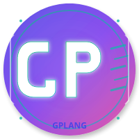

# GPLANG Language Support for Visual Studio Code



The official Visual Studio Code extension for **GPLANG** - the fastest programming language that's easier than Python and faster than C!

## Features

### 🎨 **Syntax Highlighting**
- Full syntax highlighting for `.gp` files
- Support for all GPLANG keywords, operators, and constructs
- Beautiful color themes optimized for GPLANG code

### 🚀 **IntelliSense & Auto-completion**
- Smart code completion for GPLANG keywords
- Built-in function suggestions
- Module and library auto-completion
- Snippet support for common patterns

### 🔧 **Compiler Integration**
- Compile GPLANG files directly from VSCode
- Run GPLANG programs with a single keystroke
- Ultra-fast optimization with one click
- Real-time error checking and diagnostics

### ⚡ **Performance Optimization**
- Performance hints and suggestions
- Automatic detection of optimization opportunities
- Ultra-mode compilation support
- Parallel processing recommendations

### 📚 **Rich Language Support**
- Code folding and indentation
- Bracket matching and auto-closing
- Comment toggling
- Symbol navigation

## Installation

### Automatic Installation
```bash
cd vscode-extension
./install.sh
```

### Manual Installation
1. Download the `.vsix` file from releases
2. Open VSCode
3. Press `Ctrl+Shift+P` and type "Extensions: Install from VSIX"
4. Select the downloaded `.vsix` file

## Usage

### Commands
- **Compile**: `Ctrl+Shift+B` - Compile the current GPLANG file
- **Run**: `Ctrl+F5` - Run the current GPLANG file
- **Optimize**: Right-click → "Optimize GPLANG File"

### Snippets
Type these prefixes and press `Tab`:
- `func` - Create a function
- `main` - Create main function
- `if` - If statement
- `for` - For loop
- `class` - Class definition
- `import` - Import statement
- `vec2` - Create 2D vector
- `vec3` - Create 3D vector
- `websocket` - WebSocket setup
- `graphql` - GraphQL query

## Configuration

Configure the extension in VSCode settings:

```json
{
  "gplang.compilerPath": "gplang",
  "gplang.optimizationLevel": "ultra",
  "gplang.enableLinting": true,
  "gplang.showPerformanceHints": true
}
```

### Settings
- **gplang.compilerPath**: Path to the GPLANG compiler
- **gplang.optimizationLevel**: Optimization level (none, basic, aggressive, extreme, ultra)
- **gplang.enableLinting**: Enable real-time error checking
- **gplang.showPerformanceHints**: Show performance optimization suggestions

## Themes

The extension includes custom themes optimized for GPLANG:
- **GPLANG Dark**: Dark theme with vibrant syntax colors
- **GPLANG Light**: Light theme for daytime coding

## Language Features

### Supported Syntax
```gplang
# GPLANG Example
import math
import string
import crypto

func fibonacci(n):
    if n <= 1:
        return n
    return fibonacci(n-1) + fibonacci(n-2)

func main():
    # Ultra-fast parallel processing
    parallel for i in range(1000000):
        var result = fibonacci(i)
        print("fib(" + str(i) + ") = " + str(result))
    
    # Advanced vector operations
    var v1 = math.vec3_create(1.0, 2.0, 3.0)
    var v2 = math.vec3_create(4.0, 5.0, 6.0)
    var dot_product = math.vec3_dot(v1, v2)
    
    # Cryptographic operations
    var hash = crypto.hash_string("Hello, GPLANG!", crypto.HASH_SHA256)
    print("Hash: " + crypto.hash_to_hex(hash))
    
    return 0
```

### Module Support
- **math**: Mathematical operations, vectors, matrices
- **string**: Advanced string manipulation
- **crypto**: Cryptography and security
- **time**: Date and time operations
- **collections**: Data structures
- **fs**: File system operations
- **os**: Operating system interface
- **net**: Networking
- **json**: JSON parsing
- **websocket**: WebSocket communication
- **graphql**: GraphQL client
- **socketio**: Socket.IO support

## Performance Features

### Ultra-Fast Compilation
- **18+ optimization passes** for maximum performance
- **SIMD vectorization** for parallel operations
- **CPU-specific optimizations** for your hardware
- **Link-time optimization** for whole-program analysis

### Real-time Hints
The extension provides intelligent performance suggestions:
- Convert loops to parallel processing
- Use SIMD operations for math-heavy code
- Optimize memory access patterns
- Suggest faster algorithms

## Requirements

- Visual Studio Code 1.74.0 or higher
- GPLANG compiler installed and in PATH
- Node.js (for extension development)

## Extension Development

### Building from Source
```bash
git clone https://github.com/gplang/gplang
cd gplang/vscode-extension
npm install
npm run compile
vsce package
```

### Contributing
1. Fork the repository
2. Create a feature branch
3. Make your changes
4. Add tests
5. Submit a pull request

## Changelog

### 1.0.0
- Initial release
- Full syntax highlighting
- Compiler integration
- Performance optimization hints
- Code snippets and auto-completion
- Custom themes

## Support

- **Documentation**: [GPLANG Docs](https://gplang.dev/docs)
- **Issues**: [GitHub Issues](https://github.com/gplang/gplang/issues)
- **Community**: [Discord Server](https://discord.gg/gplang)

## License

MIT License - see [LICENSE](LICENSE) file for details.

---

**Made with ❤️ by the GPLANG Team**

*Experience the future of programming with GPLANG - where Python's simplicity meets C's performance!*
